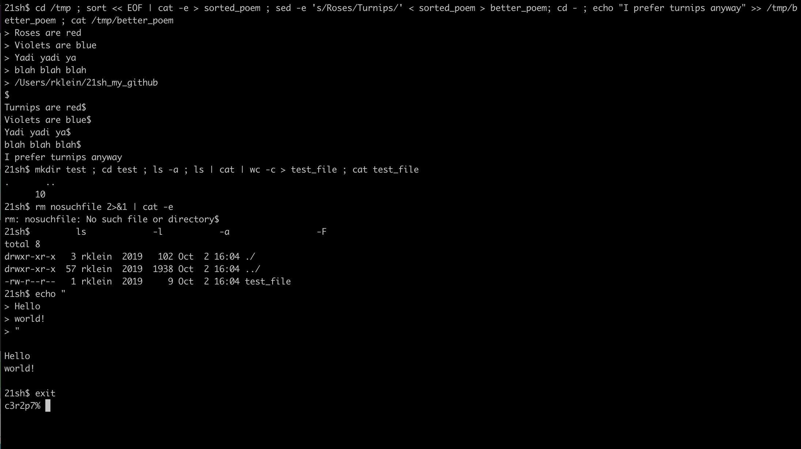

# 21sh
Taking [minishell](https://github.com/robkle/minishell) to the next level. 
**21sh** is a Unix shell with: 
* line edition features 
* ctrl+D and ctrl+C handling 
* redirection '<', '>', '<<', and '>>' 
* pipe '|'
* file descriptor aggregation
* command line seperation with ';' 
* command history navigation with up and down arrows 
* complete managament of quotes and double quotes 

### Usage
Repository contains a Makefile for:  
* compiling executable (**make all**) 
* removing object files (**make clean**) 
* deleting executable (**make fclean**) 
* recompiling (**make re**) 

Example of 21sh: 
 
#### Notes:
This project was done together with [VictoriaElisabet](https://github.com/VictoriaElisabet) and is part of my studies at Hive Helsinki. 
My part of the code handles the line edition, command history, and signal handling.  
This project was thoroughly tested by 5 fellow Hive students.
